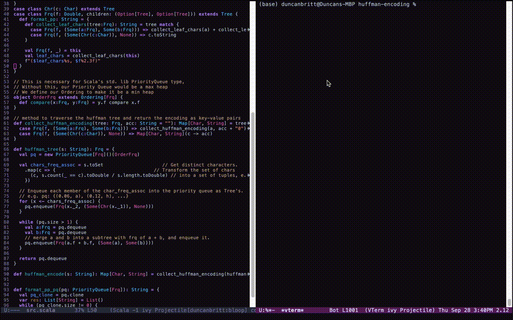

# Algorithms
As of Fall 2023 I'm taking Algorithms at CU Boulder. This repository is a showcase of my implementations of the algorithms we are studying.
<details>
<summary><b><u><font size="+20">Huffman Encoding</font></u></b></summary>



<details>
<summary>A sample of the source code:</summary>

```scala
  def huffman_tree(s: String): Frq = {
    val pq = new PriorityQueue[Frq]()(OrderFrq)

    val chars_freq_assoc = s.toSet                        // Get distinct characters.
      .map(c => {                                         // Transform the set of chars
        (c, s.count(_ == c).toDouble / s.length.toDouble) // into a set of tuples, e.g. ("a", 0.06)
      })

    // Enqueue each member of the char_freq_assoc into the priority queue as Tree's.
    // e.g. pq: {(0.06, a), (0.12, h), ...}
    for (x <- chars_freq_assoc) {
      pq.enqueue(Frq(x._2, (Some(Chr(x._1)), None)))
    }

    while (pq.size > 1) {
      val a:Frq = pq.dequeue
      val b:Frq = pq.dequeue
      // merge a and b into a subtree with frq of a + b, and enqueue it.
      pq.enqueue(Frq(a.f + b.f, (Some(a), Some(b))))
    }

    return pq.dequeue
  }
```
</details>
</details>
